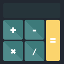

# HCalculator

![badge-platforms][] [![badge-ci][]][travis] [![badge-codecov][]][codecov]

Really basic calculator made in SwiftUI.

[badge-platforms]: https://img.shields.io/badge/platforms-macOS%20%7C%20iOS%20%7C%20iPadOS-lightgrey.svg
[badge-codecov]: https://codecov.io/gh/codecov/example-swift/branch/master/graphs/badge.svg
[badge-ci]: https://travis-ci.com/Henryforce/HCalculator.svg?branch=master

[codecov]: https://codecov.io/gh/Henryforce/HCalculator/branch/master
[travis]: https://travis-ci.com/Henryforce/HCalculator
